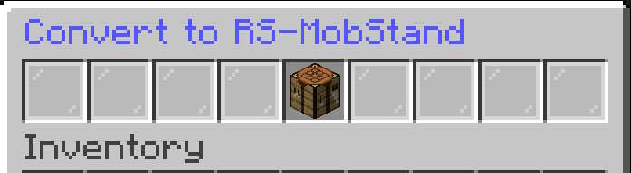
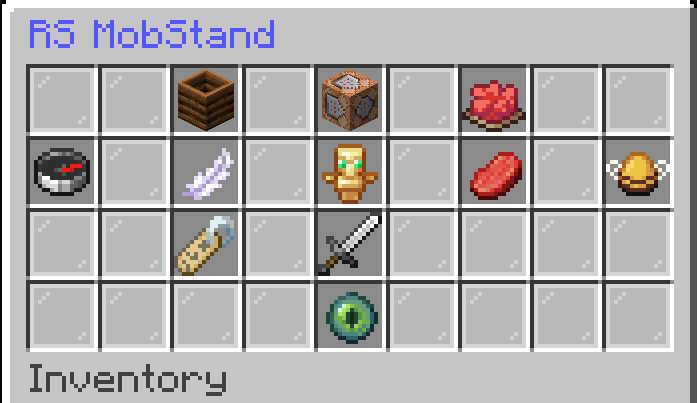

# Creating Your First MobStand

## Overview

RS-MobStand turns a standard Minecraft **Armor Stand** into an automated Mob Stand.
Once converted, the stand can be configured through its inventory-based menu.
MobStands cannot be broken. they must be converted back to **Armor Stand** to be moved.

---

## 1. Place an Armor Stand
Place a normal Armor Stand at the location where you want the Mob Stand to operate.
The Armor Stand becomes the physical location and visual representation of the Mob Stand.

---

## 2. Convert the Armor Stand
- Sneak and click the armor stand with a stick to get the conversion menu.
- A menu will open with a **Crafting Table** in the center slot.  Click the **Crafting Table** to convert the **Armor Stand** to the **RS-MobStand**.

Screenshot:

After a successful conversion:

- The Armor Stand becomes an **RS-MobStand**.
- The Mob Stand is initially **paused**.
- The stand is ready to be configured.

The Mob Stand starts paused so you can configure it before it begins automated mob management.

---

## 3. Open the Mob Stand Menu
Open the Mob Stand's configuration menu to access its settings.
The main menu provides controls for:

- Pause / Resume (Red/Green Dye)
- Scan Radius (Compass)
- Gravity (Feather)
- Leave Alive (Totem of Undying)
- Adult Filters (Pork Chop)
- Baby Filters (Bee Egg)
- Show/Hide Display Name (Name Tag)
- Arm Poses (Sword)
- View Radius (Eye of Ender)
- Convert Back (Composter)

Operators may also have access to the administrative menu.

Screenshot:

---

## 4. Configure the Mobs
Before resuming the Mob Stand, configure which mobs it should manage.

### Baby Mobs
Use **Baby Filters** to select the baby mobs the stand should affect.
These filters work as **whitelists**.
A mob must be configured in the appropriate filter before the Mob Stand will affect it.

---

## 5. Configure the Scan Radius
Set the horizontal scan radius to determine how far from the Mob Stand mobs can be detected.
The vertical scan area is limited to:

- 2 blocks above the stand's base level
- 2 blocks below the stand's base level

You can use **View Radius** to temporarily display the configured operating area with particles.
The visualization is visible only to the player who activates it.

---

## 6. Configure Leave Alive
The **Leave Alive** setting allows you to specify how many configured mobs should remain alive while the Mob Stand performs its automated management.
Adjust this setting to suit the way you want the area to operate.

---

## 7. Customize the Armor Stand
RS-MobStand includes visual customization options for the Armor Stand.

### Display Name
Use **Display Name** to show or hide the Mob Stand's in-world name.

### Arm Poses
Enable the Armor Stand's arms and open **Arm Poses** to configure each hand independently.
Both the Main Hand and Off Hand support:

- Down
- 1/4 Down
- Straight Out
- 1/4 Up
- Straight Up

Each hand can use a different pose.

---

## 8. Resume the Mob Stand
Once configuration is complete, resume the Mob Stand.
The stand will then begin its automated mob management using the settings you selected.
You can pause it again at any time from the main menu.

---

## Converting Back
If you no longer want the Armor Stand to function as an RS-MobStand, use **Convert Back**.
The Mob Stand is returned to a standard vanilla Armor Stand.
This follows the RSScripting conversion standard: an RS device can be converted back into the standard vanilla object it was created from.
