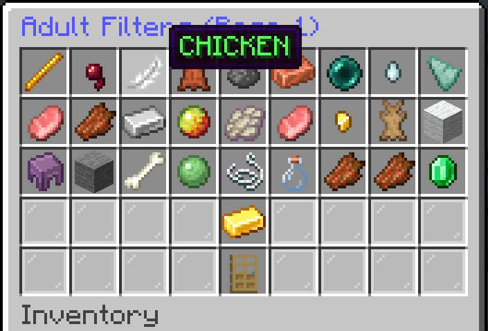
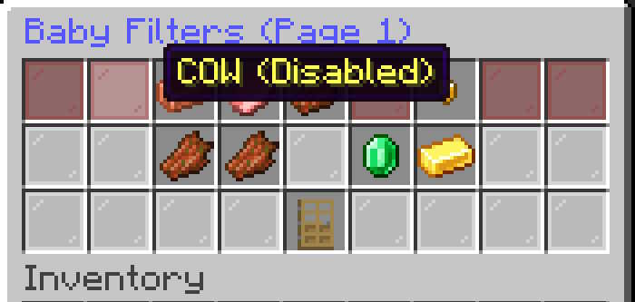

# Filters

## Overview
RS-MobStand uses separate filters for **Adult** and **Baby** mobs.
These filters determine which mobs a Mob Stand is allowed to affect.

> **Important:** The filters act as whitelists. A mob that is not selected, or is custom named is ignored by the Mob Stand.

---

## Adult Filters

The **Adult Filters** menu controls which adult mobs the Mob Stand can affect.
To configure adult mobs:

1. Open the Mob Stand menu.
2. Select **Adult Filters**.
3. Select the adult mob types you want the Mob Stand to manage.
4. Leave unwanted mob types unselected.

Only adult mobs included in the Adult Filters are eligible to be affected.

Screenshot:

---

## Baby Filters

The **Baby Filters** menu controls which baby mobs the Mob Stand can affect.

To configure baby mobs:

1. Open the Mob Stand menu.
2. Select **Baby Filters**.
3. Select the baby mob types you want the Mob Stand to manage.
4. Leave unwanted mob types unselected.

Only baby mobs included in the Baby Filters are eligible to be affected.

Screenshot:

---

## Adult and Baby Filters Are Independent

The two filter lists are separate.

For example, you can configure a Mob Stand to affect:

- Adult cows
- Baby cows
- Adult pigs

without affecting:

- Baby pigs
- Adult sheep
- Baby sheep

Each age category must be configured independently.

---

## Whitelist Behavior
The filters do **not** mean "kill everything except what is excluded."
Instead, they define the exact mob types the Mob Stand is permitted to kill.

### Example
If the Adult Filters contain:

- Cow
- Pig
- Sheep

then:

- Adult cows can be affected.
- Adult pigs can be affected.
- Adult sheep can be affected.
- Adult chickens are ignored.
- Adult zombies are ignored.

If Baby Filters contain only:

- Cow

then:

- Baby cows can be affected.
- Baby pigs are ignored.
- Baby sheep are ignored.

---

## Changing Filters
Filters can be changed at any time from the Mob Stand menu.
Changes apply to the Mob Stand's subsequent mob-management operations.
You do not need to create a new Mob Stand when changing its filters.
